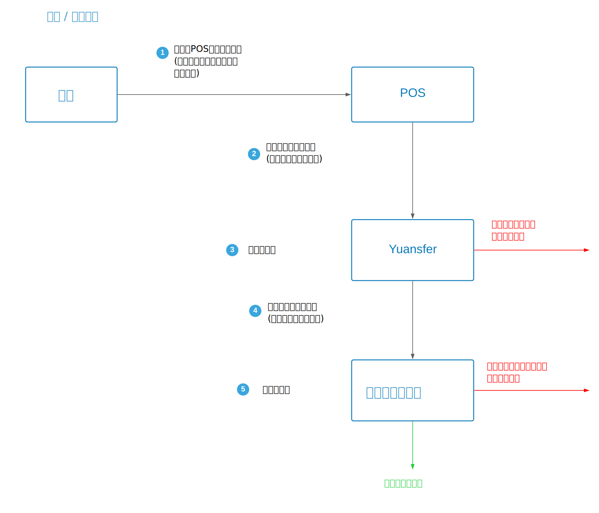

# 安全性

### 加密

在传输过程中，所有敏感数据（包括交易ID，交易金额和商家ID）均已加密并使用RSA\_AES算法。

* AES密匙大小: 256 bits
* RSA密匙大小: 2048 bits

### 服务器安全性

Yuansfer使用阿里云并启用Web应用程序防火墙来防御最常见的攻击，例如（但不限于）SQL注入，XSS跨站点脚本，常见的Web服务器插件漏洞，特洛伊木马上传以及未授权对核心的访问资源。

### 认证与授权

在交易过程中没有传输任何秘密令牌或者用户密码。对于黑客来说是不可能进行欺诈交易，因为Yuansfer和电子钱包服务器在每个步骤中都进行身份验证和授权，以验证每笔交易。

### 豁免PCI / PII

Yuansfer的网关不与任何银行卡网络处理组件交互以进行PCI范围划分，而AliPay交易数据是PCI范围外的，并且不受PCI DSS标准的约束。

