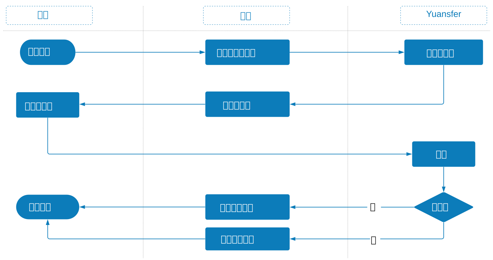

# 创建二维码

### 创建二维码用例的摘要如下：

1. 零售商店中的消费者商店，将商品带到销售终端进行结帐。 
2. 出现提示时，消费者指示他们想通过二维码付款。 
3. 商家向用户在销售终端中指示的钱包进行初始化，并创建二维码显示出来。 
4. 消费者打开钱包应用程序并扫描商家创建的二维码。 
5. Yuansfer收到了来自钱包服务的钩子，并向钱包服务请求了交易以进行处理：消费者在手机上看到页面批准交易。 
6. 钱包服务会根据消费者的决定\(接受还是取消\)来处理付款，并将付款状态发送给消费者和Yuansfer。 
7. Yuansfer将来自钱包服务的处理结果传送到商家的销售终端。 
8. 消费者收集销售终端收据，并带着购买的商品离开商店。

### 创建二维码付款流程

1. 客户选择商品，商人系统请求Yuansfer系统创建交易二维码。 
2. Yuansfer系统返回二维码，商人将二维码显示给客户。
3.  客户使用电子钱包应用程序扫描二维码以结账。 
4. 支付成功后，Yuansfer系统将支付结果发送给商家的系统。

