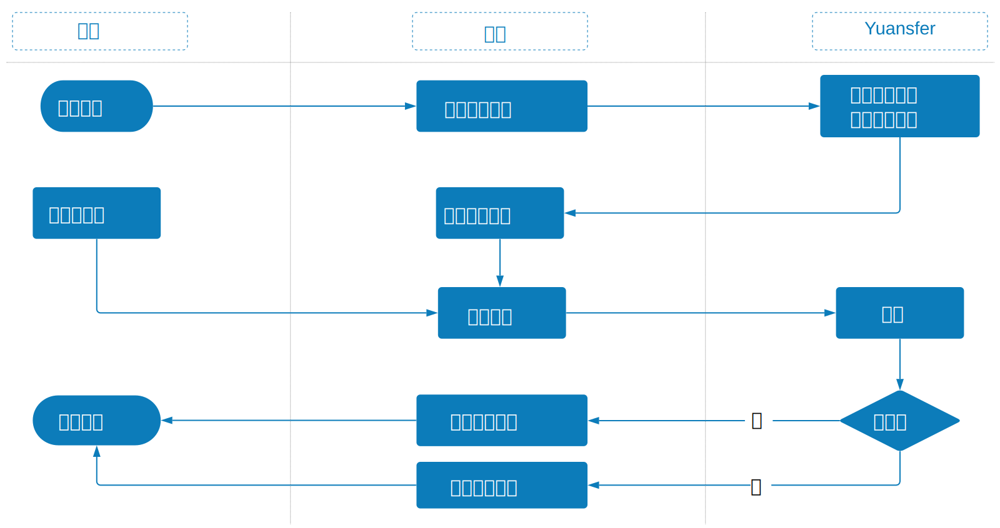

# 扫描二维码

### 扫描二维码用例的摘要如下：

1. 顾客在零售商店中消费，将商品带到销售终端进行结帐。
2. 当出现提示时，消费者指示他们想通过二维码付款。 消费者打开钱包应用程序并显示二维码。
3. 商家在销售终端机初始化消费者选定的钱包，然后扫描二维码并将其值传递给Yuansfer。
4. Yuansfer解析二维码值，并检测到该交易应传送到到所需的钱包服务进行处理：消费者在手机上看到页面批准交易。
5. 钱包服务会根据消费者的决定\(接受还是取消\)来处理付款，并将付款状态发送给消费者和Yuansfer。
6. Yuansfer将来自钱包服务的处理结果传送到商家的销售终端。
7. 消费者收集销售终端收据，并带着购买的商品离开商店。

### 扫描二维码付款流程

1. 客户选择商品，商家系统请求向Yuansfer系统创建交易。
2. Yuansfer系统将交易ID返回给商家的系统。
3. 客户在其钱包应用程序上显示条形码或二维码以进行结账。
4. 商家的系统发送带有交易ID和来自客户的条形码或二维码的付款请求。
5. Yuansfer系统将付款结果发送到商家的系统。
6. 商家的系统将付款结果显示给客户。

