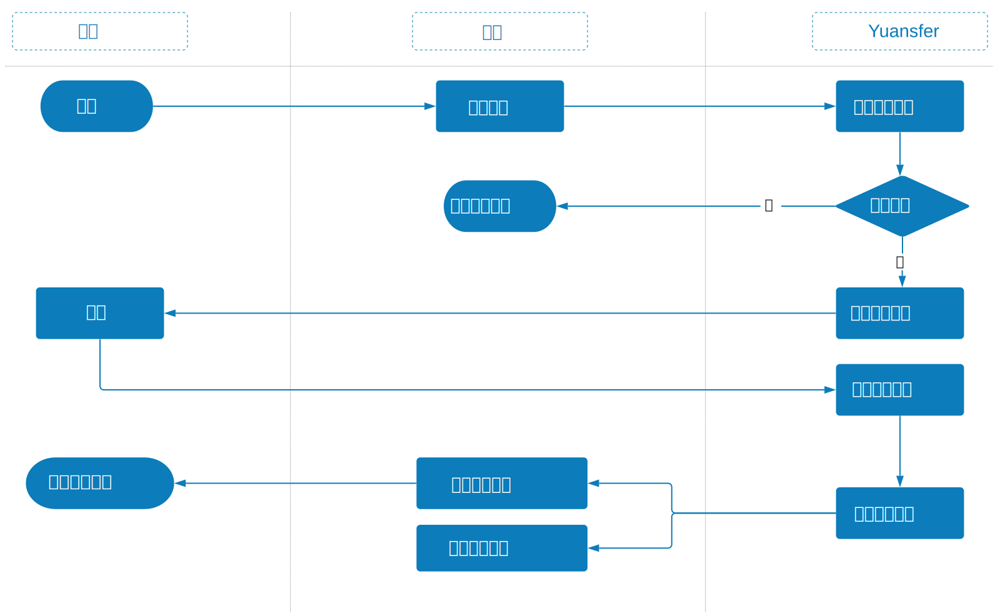
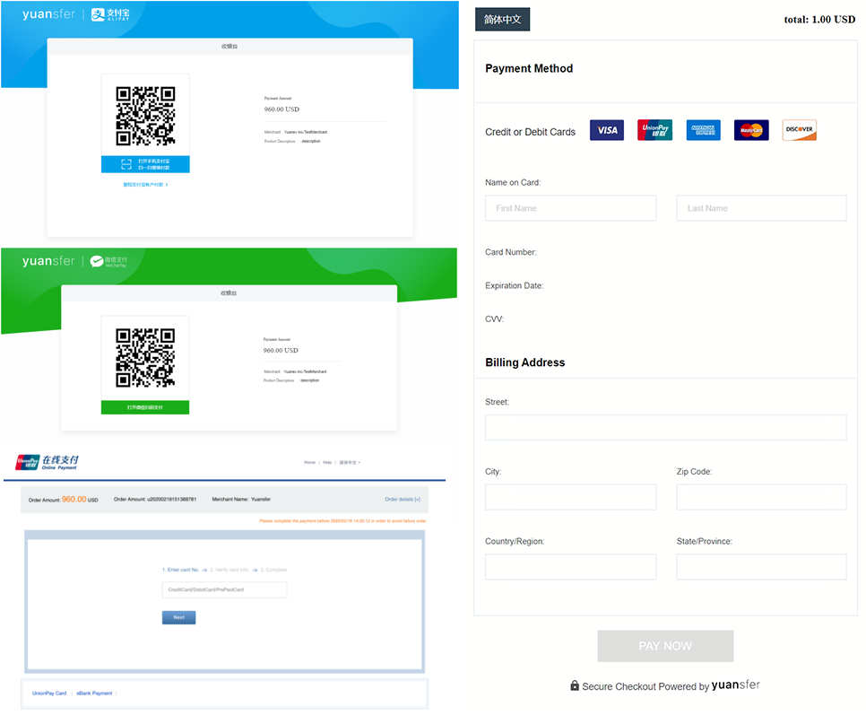
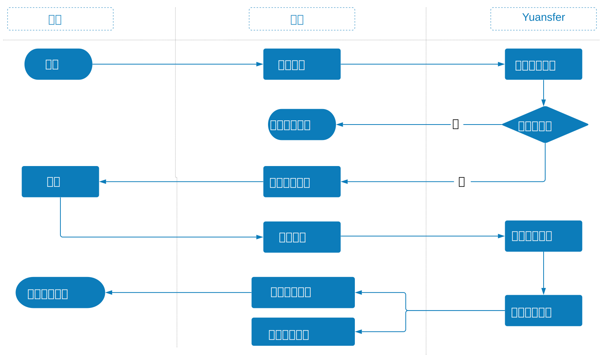

# 在线付款

Yuansfer为您的客户提供了他们喜好的支付方式，其中包括标准卡和各种电子钱包。您可以将Yuansfer的在线支付解决方案快速集成到您的网站和移动应用程序中。

您可以选择一下几种集成方式。

1. 集成Yuansfer托管的安全付款页面，该方法也叫Yuansfer付款。
2. 集成Yuansfer API并为您喜好的付款方式构建自己的UI，该方法也叫Yuansfer集成付款。

<table>
  <thead>
    <tr>
      <th style="text-align:left"><b>&#x96C6;&#x6210;&#x9009;&#x9879;</b>
      </th>
      <th style="text-align:left"><b>&#x529F;&#x80FD;</b>
      </th>
      <th style="text-align:left"><b>&#x4F7F;&#x7528;&#x65F6;&#x673A;</b>
      </th>
    </tr>
  </thead>
  <tbody>
    <tr>
      <td style="text-align:left">
        
Yuansfer

        
&#x4ED8;&#x6B3E;

      </td>
      <td style="text-align:left">&#x5C06;&#x5BA2;&#x6237;&#x91CD;&#x5B9A;&#x5411;&#x5230;Yuansfer&#x6258;&#x7BA1;&#x7684;&#x7ED3;&#x5E10;&#x9875;&#x9762;</td>
      <td
      style="text-align:left">&#x60A8;&#x65E0;&#x6CD5;&#x6258;&#x7BA1;&#x4ED8;&#x6B3E;&#x8868;&#x683C;&#x3002;</td>
    </tr>
    <tr>
      <td style="text-align:left">
        
Yuansfer

        
&#x96C6;&#x6210;

        
&#x4ED8;&#x6B3E;

      </td>
      <td style="text-align:left">&#x4EC5;&#x4F7F;&#x7528;Yuansfer API&#xFF0C;&#x7136;&#x540E;&#x4E3A;&#x6BCF;&#x79CD;&#x4ED8;&#x6B3E;&#x65B9;&#x5F0F;&#x6784;&#x5EFA;&#x81EA;&#x5DF1;&#x7684;UI&#x3002;</td>
      <td
      style="text-align:left">&#x4F60;&#x60F3;&#x8981;&#x5F00;&#x53D1;&#x5B8C;&#x5168;&#x81EA;&#x5B9A;&#x4E49;&#x7684;&#x4ED8;&#x6B3E;&#x8868;&#x5355;&#x548C;&#x53EF;&#x63A7;&#x7684;UI&#x3002;</td>
    </tr>
  </tbody>
</table>

### Yuansfer付款流程

您可以使用[secure-pay](../api-can-kao-v3/zhi-fu/zai-xian-zhi-fu/yuansfer-fu-kuan.md)接口来集成Yuansfer付款

1. 当客户下订单时，商家的系统将订单提交给Yuansfer系统。 
2. Yuansfer系统将客户引导到“收银员页面”进行结帐。 收银员页面根据所选的付款服务显示不同的付款方式。
3.  客户在收银员页面上确认付款。 
4. Yuansfer系统将付款结果发送到商家的系统。 
5. 商家的系统将付款结果显示给客户。

**以下是几个结帐页面的屏幕截图。**

### Yuansfer的集成付款

您可以使用[prepay](../api-can-kao-v3/zhi-fu/zai-xian-zhi-fu/zong-he-zhi-fu/)接口来使用Yuansfer的集成付款。

1. 当客户下订单时，商人的系统将订单提交给Yuansfer系统。 
2. Yuansfer系统生成一个新的交易ID，并将其返回给商家的系统。 
3. 商家的系统显示自己的收银员页面，客户可以在页面上选择首选的付款方式。 
4. 客户在收银员页面上确认付款。 
5. 商家的系统将客户的付款请求以及所需的参数发送给Yuansfer。 
6. Yuansfer系统将付款结果发送到商家的系统。 
7. 商家的系统将付款结果显示给客户。

